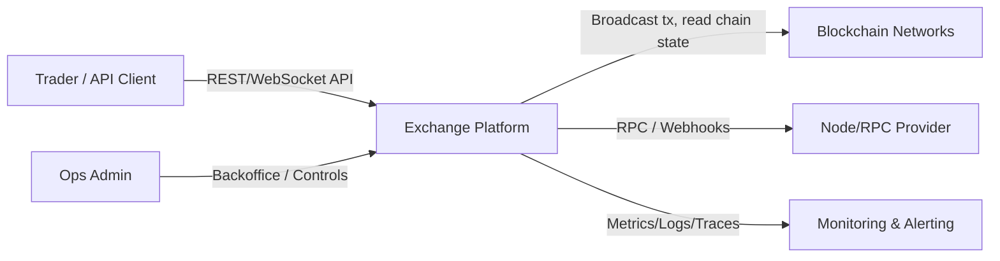
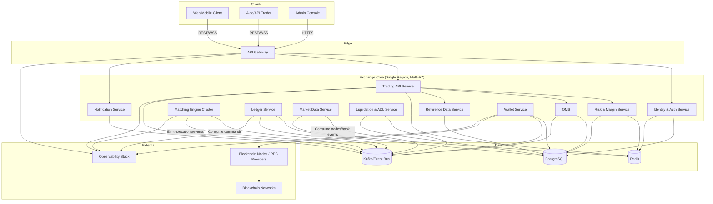

# High Level Design: Crypto Exchange (Spot + Perpetual Futures)

## 1) Scope and Assumptions

- Exchange type: `custodial`
- Products: `spot` and `perpetual futures`
- Users: `1,000,000 registered`, `300,000 DAU`, `500,000 MAU`
- Traffic target: up to `10,000 RPS` (API aggregate)
- Initial markets: `BTC/USDT`, `ETH/USDT`, `SOL/USDT`, `TON/USDT`
- Deposits/withdrawals: `crypto only`
- Compliance: KYC/AML not in MVP
- SLA: `uptime 99.9%`, `p99 <= 100ms` (external API for critical trading endpoints)
- Deployment: single region first, architecture should support multi-region expansion

## 2) Architecture Goals

- Low-latency order placement/cancel/match.
- Strong balance correctness (`no negative balance`, `no double spend`).
- Independent scaling of hot paths: API, matching, market data, wallet integration.
- Extensibility for new pairs without core redesign.
- Operational resilience with clear failure isolation.

## 3) High-Level Components

1. `API Gateway / Edge`
- TLS termination, auth, rate limiting, request routing.

2. `Identity & Auth Service`
- User accounts, API keys, JWT/session validation, permissions.

3. `Trading API Service`
- Client endpoints: place/cancel order, query order status, balances, positions.
- Synchronous validation + async command emission.

4. `Risk & Margin Service`
- Pre-trade checks:
  - Spot: available balance checks.
  - Perpetual: initial/maintenance margin checks, leverage limits.
- Position/risk snapshots for liquidation logic.

5. `Matching Engine Cluster`
- Core matching for each market with price-time priority.
- Deterministic event output: accepted/rejected, trade executions, order state changes.
- Partitioning model: `one market -> one engine shard` (or pinned logical partition).

6. `Order Management Service (OMS)`
- Receives client intent and engine events.
- Maintains canonical order lifecycle view for APIs.

7. `Ledger Service (Double-Entry)`
- Source of truth for money movement.
- Records all account mutations:
  - deposits
  - withdrawals
  - trade settlements
  - fees
  - funding (for perpetuals)
  - liquidation transfers

8. `Wallet Service`
- Blockchain integrations (nodes/providers), address management, signing, broadcast.
- Deposit detection and withdrawal execution workflow.
- Hot/cold wallet policy integration.

9. `Market Data Service`
- Real-time streams: order books, trades, ticker, funding metrics.
- Snapshot + incremental feeds for WebSocket clients.

10. `Liquidation & ADL Service`
- Monitors perp risk state, triggers liquidation orders.
- Handles bankruptcy/insurance/ADL strategy (phase-based).

11. `Reference Data Service`
- Markets metadata (pairs, precision, tick/lot size, status).
- Dynamic pair onboarding without engine redesign.

12. `Notification Service`
- User notifications: order fills, liquidations, withdrawal statuses.

13. `Admin & Ops Backoffice`
- Market controls, risk parameters, wallet limits, incident tools.

14. `Observability Stack`
- Metrics, logs, traces, alerting, SLO dashboards, audit trails.

## 4) Core Data Stores and Messaging

- `Kafka` (or equivalent durable log/bus):
  - trading commands/events
  - market data fanout backbone
  - wallet and ledger integration events
- `Redis`:
  - low-latency cache, rate-limit counters, ephemeral session data
- `PostgreSQL` (or compatible relational DB):
  - accounts, orders projection, ledger, wallet operations, reference data
- Optional specialized stores:
  - time-series/columnar sink for analytics and long-term market history

Design principle:
- `Matching engine` owns matching state in memory + durable event stream.
- `Ledger` owns monetary truth.
- Read APIs use projections/materialized views.

## 5) Component Interaction (Main Flows)

## 5.1 Place Order (Spot/Perp)

1. Client -> `API Gateway` -> `Trading API`
2. `Trading API` authenticates/authorizes user.
3. `Trading API` requests `Risk Service` pre-trade validation.
4. If valid, order command published to market-specific topic/partition.
5. `Matching Engine` consumes command, executes matching, emits execution events.
6. `OMS` updates order state projection.
7. `Ledger Service` applies settlement/fees and updates balances/positions.
8. `Market Data Service` publishes book/trade updates.
9. Client receives ack/result via REST/WebSocket.

## 5.2 Deposit (Crypto)

1. `Wallet Service` observes blockchain transactions.
2. On required confirmations, emits `deposit_confirmed` event.
3. `Ledger Service` credits user account.
4. `Trading API`/UI reflects updated available balance.

## 5.3 Withdrawal (Crypto)

1. Client submits withdrawal request.
2. `Trading API` validates auth + limits + available funds.
3. `Ledger Service` reserves/debits funds (state machine with idempotency key).
4. `Wallet Service` signs and broadcasts tx.
5. On-chain result updates withdrawal status; reconciliation jobs ensure consistency.

## 6) Scalability Model

## Horizontal Scaling

- `API Gateway`, `Trading API`, `Market Data`, `OMS`, `Risk` are stateless and scale horizontally.
- `Matching Engine` scales by market partitioning:
  - initial pairs can share a small cluster
  - as load grows, hot markets get dedicated shards/nodes

## Capacity Direction for 10k RPS

- Keep synchronous request path minimal: auth + risk + enqueue command.
- Heavy state transitions are event-driven and parallelized downstream.
- WebSocket fanout is isolated from order processing path.

## Add New Trading Pair

1. Create pair metadata in `Reference Data`.
2. Allocate market to engine shard.
3. Initialize order book state and market data streams.
4. Enable market via admin control plane.

No redesign required; only control-plane and shard-capacity operations.

## 7) Latency and SLA Strategy

Target: `p99 <= 100ms` for critical trading endpoints under stated load.

Key controls:
- In-memory matching engine (no DB writes in matching hot path).
- Pre-trade checks optimized with cached risk/balance snapshots.
- Async durable event pipeline for post-trade projections.
- Strict timeout budgets per hop.
- Backpressure/rate-limits to protect engine and wallet paths.

Availability (`99.9%`):
- Multi-AZ deployment in single region.
- Replicated message bus and databases.
- Health checks, rolling deployments, circuit breakers, retry with idempotency.

## 8) Consistency, Integrity, and Safety

- Monetary state uses `double-entry ledger` invariants.
- Every external mutation uses idempotency keys.
- Exactly-once effect is modeled via:
  - at-least-once delivery + idempotent consumers
  - deterministic event IDs and replay-safe handlers
- Periodic reconciliation:
  - ledger vs wallet balances
  - ledger vs OMS projections

## 9) Security Model (MVP)

- API key scopes, request signing for trading APIs.
- Mandatory TLS, secret management, key rotation.
- Wallet security:
  - hot/cold separation
  - withdrawal quotas and velocity limits
  - manual approval thresholds for large withdrawals
- Audit logs for admin actions and fund movements.

## 10) Multi-Region Expansion Path

Current mode: single active region.

Expansion-ready design:
- Region-local matching engines (market ownership by region or market group).
- Global identity + reference data replication.
- Event replication pipeline for analytics and DR.
- Disaster recovery region with defined RTO/RPO.

Recommended phase later:
- active-passive first, then selective active-active for read-heavy services.

## 11) Out of Scope (Current MVP)

- KYC/AML workflow and external compliance orchestration.
- Fiat rails (bank/card).
- Options trading and advanced structured products.

## 12) Suggested Implementation Phases

1. Foundation:
- API gateway, auth, trading API, matching engine, OMS, ledger core, market data core.

2. Wallet and funds:
- deposit/withdraw lifecycle, reconciliation, operational controls.

3. Perpetual futures:
- margin engine, positions, liquidation flow, funding payments.

4. Reliability:
- SLO dashboards, chaos tests, failover drills, performance tuning to p99 target.

5. Scale-out:
- market sharding strategy refinement, hot-market isolation, DR region onboarding.

## 13) C4 Diagrams

## 13.1 C4 Context Diagram

## 13.2 C4 Container Diagram

## 14) Capacity and Latency Budgets (Initial)

Assumptions for sizing:
- Aggregate API traffic up to `10,000 RPS`.
- Mix at peak (approx): `35% trading writes`, `45% reads`, `15% market data session ops`, `5% wallet/funds`.
- Peak connected WebSocket clients: `80,000-120,000`.
- `p99 <= 100ms` target applies to critical external API operations (place/cancel/query order, balance read).

| Component | Primary Responsibility | Peak QPS / Throughput (Initial) | p99 Latency Budget | Notes |
|---|---|---:|---:|---|
| API Gateway | TLS, auth enforcement, routing, rate-limit | 10,000 RPS in / 10,000 RPS out | 8 ms | Stateless horizontal scale, per-IP and per-key limits |
| Identity & Auth | API key/JWT validation, scopes | 3,000 RPS | 10 ms | Cache-first token/key validation |
| Trading API Service | Place/cancel/query orchestration | 4,000 RPS (writes+critical reads) | 20 ms | Keep synchronous path minimal |
| Risk & Margin Service | Pre-trade validation | 3,500 checks/s | 15 ms | In-memory risk snapshots + periodic persistence |
| Matching Engine Cluster | Match commands per market shard | 2,500-4,000 cmds/s total | 5-15 ms internal match/ack | Hot markets can be isolated on dedicated nodes |
| OMS | Order lifecycle projection | 6,000 events/s | 20 ms async projection lag (p99) | Read model can be eventually consistent by milliseconds |
| Ledger Service | Double-entry postings | 4,000 postings/s | 25 ms (sync for reserve/debit), 50 ms async settlement | Monetary source of truth |
| Market Data Service | Book/trade fanout | 50,000-120,000 msgs/s fanout | 30 ms update propagation | Separate from order write path |
| Wallet Service | Deposit detect, withdrawal execute | 50-150 withdrawal req/s, chain-dependent deposits | 2-10 s for submission ack, chain finality outside SLA | Async workflow with state machine |
| Liquidation & ADL | Perp risk scan + liquidation triggers | 200-800 position checks/s per shard | 50 ms trigger decision | Tuned by open-interest and volatility |
| Reference Data Service | Market metadata/config | <100 RPS | 20 ms | Strongly cached |
| Notification Service | Fill/alert delivery | 2,000-10,000 events/s | 1-3 s end-user delivery | Not in critical trading SLA |
| Kafka/Event Bus | Command/event backbone | 15,000-40,000 msgs/s | <10 ms broker enqueue (p99) | Partition by market and event type |
| PostgreSQL | System of record (except in-memory book) | 5,000-10,000 TPS mixed | 10-30 ms query/commit | Use replicas for heavy reads |
| Redis | Cache, rate limits, ephemeral state | 50,000-150,000 ops/s | <3 ms | Multi-node with eviction policy controls |

Latency budget for critical `place order` (target p99 <= 100 ms):
- Gateway + auth: `<= 15 ms`
- Trading API orchestration: `<= 20 ms`
- Risk check: `<= 15 ms`
- Enqueue + engine ack: `<= 25 ms`
- Response assembly + network tail: `<= 25 ms`

Total: `<= 100 ms` p99 (external).

## 15) Technology Stack (Rust-first)

Principle:
- Production services are implemented in Rust to maximize latency predictability, memory safety, and runtime efficiency.

## 15.1 Service Runtime and APIs

- Language: `Rust (stable toolchain)`
- Async runtime: `tokio`
- HTTP API: `axum`
- gRPC (internal where needed): `tonic`
- Serialization: `serde`, `serde_json`
- Validation: custom domain validation + lightweight request validators

## 15.2 Messaging and Streaming

- Kafka client: `rdkafka` (librdkafka-based)
- Event encoding:
  - MVP: JSON with strict schema versioning
  - Scale phase: `protobuf` (or `avro`) with schema registry
- Event model requirements:
  - global `event_id`
  - `idempotency_key` for external mutations
  - `event_version` for evolution

## 15.3 Data Access

- PostgreSQL access: `sqlx` (async, compile-time checked queries) or `diesel` (if stronger ORM style is preferred)
- Redis: `redis-rs` (or `deadpool-redis` for pooled async access)
- Migrations: `sqlx migrate` (or `refinery`) with CI enforcement

Recommendation:
- Prefer `sqlx` for explicit query control in latency-sensitive paths.

## 15.4 Observability and Reliability

- Logging/tracing: `tracing`, `tracing-subscriber`
- OpenTelemetry: `opentelemetry` + OTLP exporter
- Metrics: `prometheus` crate + Prometheus/Grafana stack
- Error handling: `thiserror` (domain errors), `anyhow` (application boundaries only)
- Retries/backoff: `tower` middleware + bounded retry policies
- Timeouts/circuit breaking: `tower` layers and per-hop budgets

## 15.5 Security and Crypto

- TLS: `rustls`
- Password hashing (if local auth): `argon2`
- JWT/API tokens: audited libraries with strict expiration/scope controls
- Secrets: external secret manager integration via environment/sidecar
- Signing abstraction for wallets: dedicated key-management interface; HSM support as upgrade path

## 15.6 Concurrency and Performance Guidelines

- Keep matching engine hot path lock-minimal and allocation-aware.
- Use bounded channels (`tokio::sync::mpsc`) to enforce backpressure.
- Avoid blocking calls in async context; isolate unavoidable blocking via dedicated pools.
- Use `Arc` + immutable snapshots for read-heavy shared state.
- Prefer deterministic single-writer ownership for market shards.

## 15.7 Testing and Quality Gates

- Unit tests: deterministic matching/risk/ledger invariants.
- Integration tests: API + DB + Kafka flow tests.
- Property-based tests: `proptest` for matching and ledger invariants.
- Load tests: `k6` or `wrk` for API; dedicated engine replay benchmarks.
- Lints/format:
  - `cargo fmt --check`
  - `cargo clippy -- -D warnings`
  - `cargo test`
- Optional hardening:
  - `cargo audit`
  - `cargo deny`
  - sanitizers/fuzzing for critical parsers and engine inputs

## 15.8 Suggested Rust Crate Layout

- `crates/domain`: shared types, invariants, event contracts.
- `crates/matching-engine`: order book and matching core.
- `crates/risk`: margin/risk logic.
- `crates/ledger`: double-entry posting engine.
- `crates/wallet`: blockchain adapters and withdrawal workflow.
- `crates/api`: HTTP/gRPC handlers and DTO mapping.
- `crates/common`: telemetry, config, error primitives, idempotency helpers.

Rule:
- Business invariants must live in domain/core crates, not only in transport handlers.

## 15.9 Non-Rust Exceptions

- Infrastructure as code, CI/CD glue, and operational scripts may use pragmatic tooling (`bash`/`python`) where it reduces delivery friction.
- This does not change the Rust-first policy for production runtime services.

## 16) ADR Backlog (Decisions To Lock Before Implementation)

Format:
- `ADR-XX`: decision statement, options, trade-offs, final choice, consequences.

Priority legend:
- `P0`: must be decided before MVP build starts.
- `P1`: should be decided during MVP implementation.
- `P2`: can be decided before scale-out phase.

1. `ADR-01 (P0)`: Service boundaries and ownership
- Define exact service split (`trading-api`, `risk`, `matching`, `ledger`, `wallet`, `market-data`).
- Lock ownership of domain invariants per service.

2. `ADR-02 (P0)`: Market sharding strategy
- Choose `one-market-per-shard` vs grouped shards.
- Define shard reassignment and hot-market isolation procedure.

3. `ADR-03 (P0)`: Event contract format and schema evolution
- Choose JSON-only MVP vs protobuf/avro from day one.
- Define versioning, backward compatibility, deprecation policy.

4. `ADR-04 (P0)`: Delivery semantics and idempotency model
- Define at-least-once handling pattern, idempotency keys, dedup stores.
- Standardize replay behavior for all consumers.

5. `ADR-05 (P0)`: Ledger consistency model
- Lock double-entry posting rules, atomicity boundaries, posting lifecycle.
- Define reconciliation cadence and mismatch handling.

6. `ADR-06 (P0)`: Risk and margin model for perpetuals
- Define IM/MM formulas, leverage tiers, mark price source, funding logic.
- Define liquidation trigger and execution strategy baseline.

7. `ADR-07 (P0)`: Database topology and HA
- Primary/replica layout, failover approach, migration strategy.
- Define RPO/RTO targets aligned with `99.9%` SLA.

8. `ADR-08 (P1)`: Cache strategy and invalidation policy
- Define Redis key model, TTL rules, stale-read tolerance.
- Define fallback behavior on cache miss/outage.

9. `ADR-09 (P1)`: API protocol split (REST vs gRPC)
- Lock external API style and internal service protocol policy.
- Define timeout, retry, and error code standards.

10. `ADR-10 (P1)`: Wallet integration and key management
- Choose node provider strategy (self-hosted vs managed).
- Define hot/cold wallet rules, signing path, withdrawal approval thresholds.

11. `ADR-11 (P1)`: Observability and SLO instrumentation
- Define mandatory metrics/traces per service.
- Lock SLI definitions for latency, availability, and event lag.

12. `ADR-12 (P1)`: Failure handling and graceful degradation
- Define behavior when `risk`, `ledger`, `wallet`, or `kafka` are degraded.
- Decide fail-closed vs fail-open per endpoint.

13. `ADR-13 (P2)`: Multi-region expansion model
- Choose active-passive vs selective active-active.
- Define data replication scope and cross-region consistency expectations.

14. `ADR-14 (P2)`: Data retention and archival policy
- Define retention windows for orders/trades/events/logs.
- Define cold storage and query access strategy.

15. `ADR-15 (P2)`: Compliance-ready architecture hooks
- Even without MVP KYC/AML, define extension points for future compliance modules.
- Lock event/audit fields required for later regulatory integration.

Minimum ADRs to finalize before coding core trading path:
- `ADR-01`, `ADR-02`, `ADR-03`, `ADR-04`, `ADR-05`, `ADR-06`, `ADR-07`.
